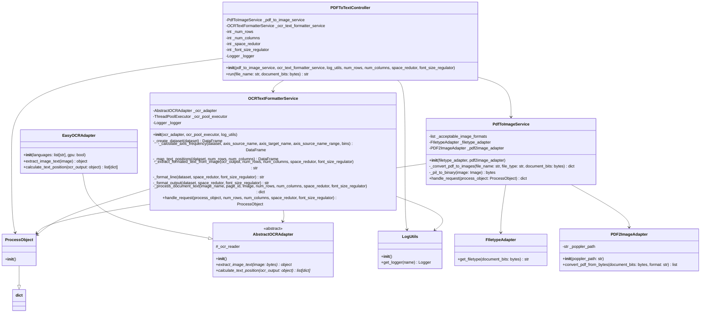

# PDF to Text Converter

A Python application that converts PDF documents and images to formatted text using OCR (Optical Character Recognition) technology.

## Overview

This application provides a complete pipeline for extracting and formatting text from PDF documents and various image formats. It uses advanced OCR capabilities with spatial text positioning to maintain the original document layout as much as possible.


## Features

- **Multi-format Support**: Handles PDF files and common image formats (PNG, JPG, JPEG, BMP, JIFF)
- **OCR Processing**: Uses EasyOCR for text extraction with multi-language support
- **Spatial Text Formatting**: Preserves document layout through intelligent text positioning
- **Concurrent Processing**: Multi-threaded OCR processing for improved performance
- **Configurable Parameters**: Adjustable formatting parameters for different document types
- **Comprehensive Logging**: Built-in logging system for monitoring and debugging

## Architecture

### Core Components

#### Controller Layer
- **PDFToTextController**: Main orchestrator that coordinates the entire conversion process

#### Service Layer
- **PdfToImageService**: Handles PDF to image conversion and file type detection
- **OCRTextFormatterService**: Manages OCR processing and text formatting with spatial awareness

#### Model Layer
- **ProcessObject**: Data transfer object that carries information through the processing pipeline

#### Adapter Layer
- **AbstractOCRAdapter**: Abstract base class for OCR implementations
- **EasyOCRAdapter**: Concrete implementation using the EasyOCR library
- **FIletypeAdapter**: File type detection using the filetype library
- **PDF2ImageAdapter**: PDF to image conversion using pdf2image library

#### Utility Layer
- **LogUtils**: Centralized logging functionality

### Design Patterns

- **Adapter Pattern**: Used for integrating external libraries (EasyOCR, pdf2image, filetype)
- **Dependency Injection**: Services receive their dependencies through constructor injection
- **Template Method**: Abstract OCR adapter defines the interface for different OCR implementations

## Class diagram


## Installation

### Prerequisites

- Python 3.8+

### Dependencies

```bash
pip install easyocr pdf2image pandas filetype
```

### System Dependencies

For PDF processing, you'll need poppler-utils:

**Ubuntu/Debian:**
```bash
sudo apt-get install poppler-utils
```

**macOS:**
```bash
brew install poppler
```

**Windows:**
Download and install poppler binaries from [poppler for Windows](https://github.com/oschwartz10612/poppler-windows/releases)

## Usage

### CLI

```
usage: main.py [-h] -f FILE_NAME [-c NUM_COLUMNS] [-r NUM_ROWS] [-s SPACE_REDUTOR] [-z FONT_SIZE_REGULATOR] [-w MAX_WORKERS] [-p POPPLER_PATH] [-l LANGUAGES] [-g GPU] -o FILE_NAME_OUTPUT

OCR Formatter options.

options:
  -h, --help            show this help message and exit
  -f FILE_NAME, --file_name FILE_NAME
                        Input file name
  -c NUM_COLUMNS, --num_columns NUM_COLUMNS
                        Number of columns of per page of the document (regulate the text position on x axis). default = 20
  -r NUM_ROWS, --num_rows NUM_ROWS
                        Number of rows per page of the document (regulate the text position on y axis). default = 35
  -s SPACE_REDUTOR, --space_redutor SPACE_REDUTOR
                        Used to smooth out the addition of tabs before each word on a line. (the higher the value, the fewer tabs will be added). default = 8
  -z FONT_SIZE_REGULATOR, --font_size_regulator FONT_SIZE_REGULATOR
                        Used to compensate for spacing based on the font of the text in the document. If your document contains text in a large font size, consider increasing this value so the text doesn't appear too sparse. default = 6
  -w MAX_WORKERS, --max_workers MAX_WORKERS
                        Max of parallel page processing. This will increse the GPU usage. default = 2
  -p POPPLER_PATH, --poppler_path POPPLER_PATH
                        Path of installation of poppler binaries. Pass the path of the /bin folder in the folder of installation of the poppler. (Window users https://github.com/oschwartz10612/poppler-windows/releases). default = None
  -l LANGUAGES, --languages LANGUAGES
                        Language of document. default = ['en', 'pt']
  -g GPU, --gpu GPU     Flag to use GPU (1) or CPU (0) in OCR
  -o FILE_NAME_OUTPUT, --file_name_output FILE_NAME_OUTPUT
                        File name output
```
### Example CLI Usage:
```bash
python main.py -f docs/lorem_ipsum.PNG -r 35 -c 30 -s 6 -z 6 -w 2 -o docs/lorem_ipsum.txt
```


### Python

```py
from pdf_to_text import create_pdf_to_text_controller


with open('docs/lorem_ipsum.PNG', "rb") as file:
    document_bits = file.read()

pdf_to_text_controller = create_pdf_to_text_controller(
    languages=['pt'],
    num_rows=35, 
    num_columns=30,
    space_redutor=6,
    font_size_regulator=6,
    max_workers=2
)    

result = pdf_to_text_controller.run(file_name=args.file_name, document_bits=document_bits)

with open("docs/lorem_ipsum.txt", "w") as file:
    file.write(result)
```

### Example of usage
